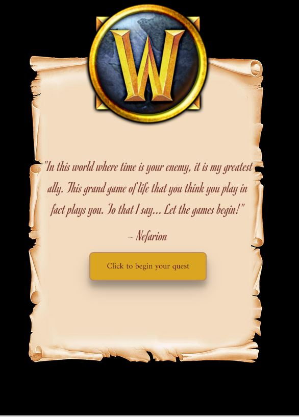
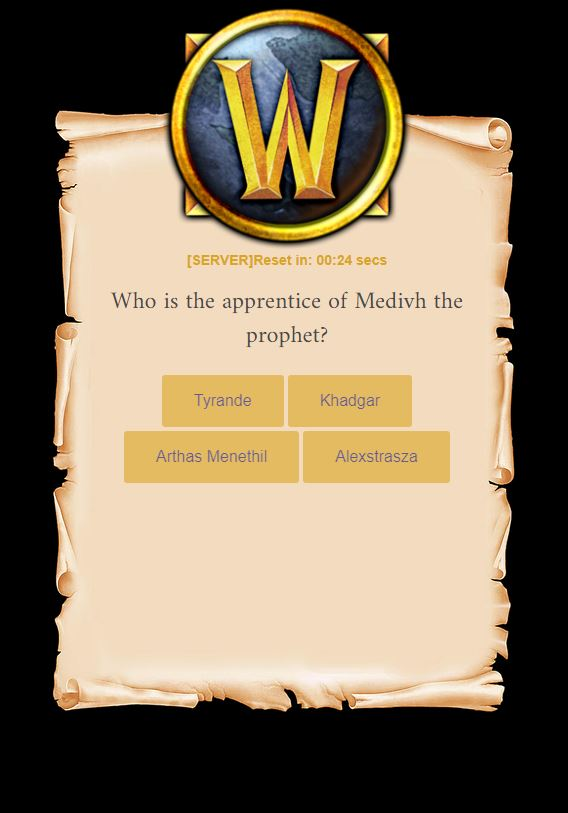
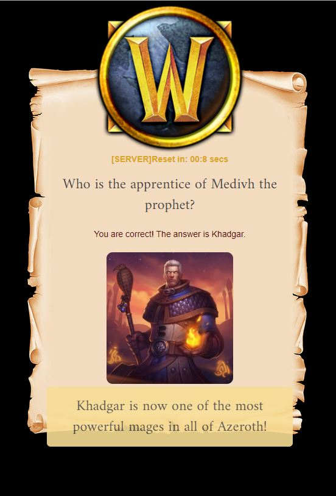
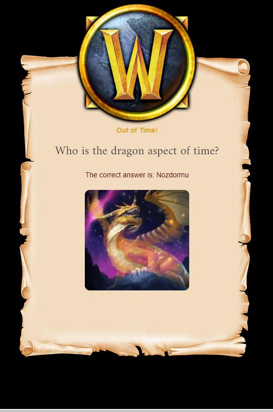
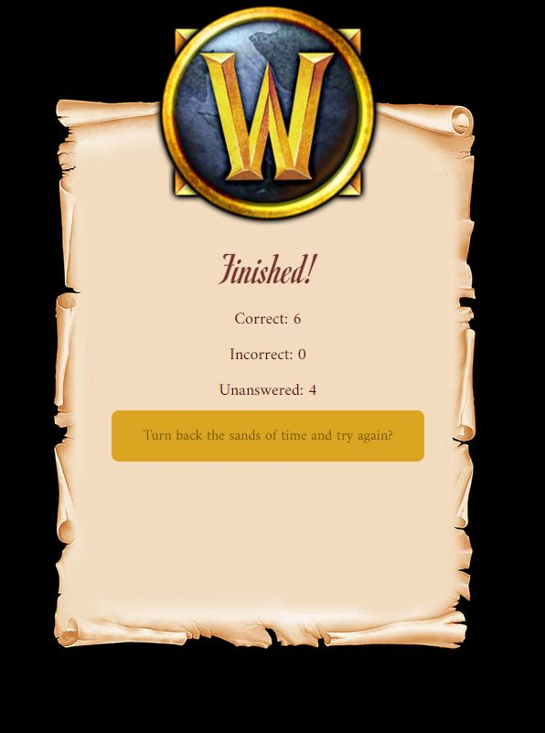

# Trivia of Warcraft
*UCF Bootcamp Assignment Week 5*

A basic trivia game with timed questions.
The user has 30 seconds to choose their answers to each question, and may only select one answer to each question.
If the user does not select an answer within the 30 second timeframe, the game records it as "unanswered" and will move onto the next question.

Click the link below to play!
[Trivia of Warcraft!](https://lamepixie.github.io/Trivia_of_Warcraft/)

## Features!
* Music from World of Warcraft
* Photos of notable characters and locations throughout Azeroth
* Will cause user to have a good time :)

# Screen Grabs

## Opening Screen

## Question Screen

## Answer Screen

## Out of Time Screen

## End Game Screen

